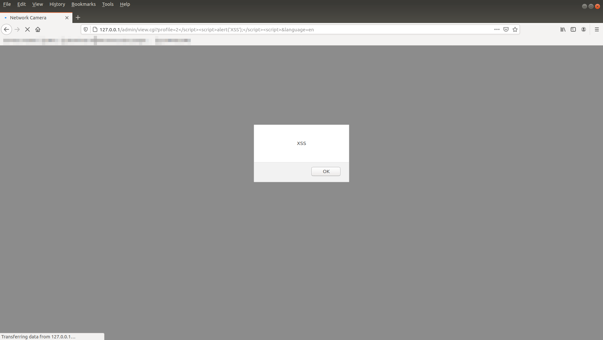

# CVE-2021-31655


**Description**


Cross Site Scripting (XSS) vulnerability in TRENDnet TV-IP110WN
V1.2.2.64, V1.2.2.65, V1.2.2.68 via the profile parameter. in a GET
request in view.cgi.
  


**Vulnerability Type**


Reflected Cross Site Scripting (XSS)
  


**Vendor of Product**


TRENDnet
  


**Affected Product Code Base**


TV-IP110WN - V1.2.2.64, V1.2.2.65, V1.2.2.68
  


**Vulnerable Page**


/admin/view.cgi
  


**Affected Component**


view.cgi
  


**Attack Type**


Remote
  


**Vulnerable Parameter**


profile
  

**Known Payload that works**


``` <script>alert('xss');</script> ```
  


**Proof of Concept**

  


**Discovered By**


Qidi Yin
  

**Reference**


https://github.com/yinfeidi/CVE-2021-31655
  
